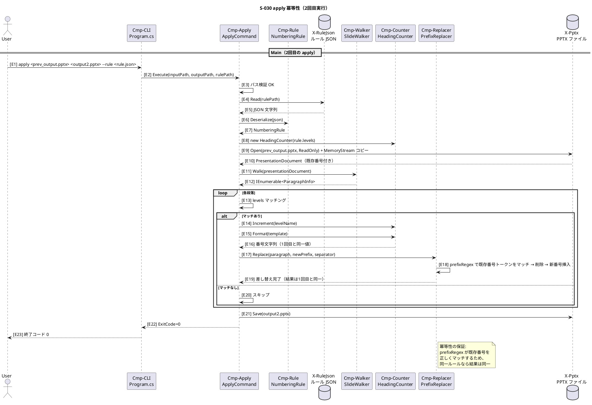
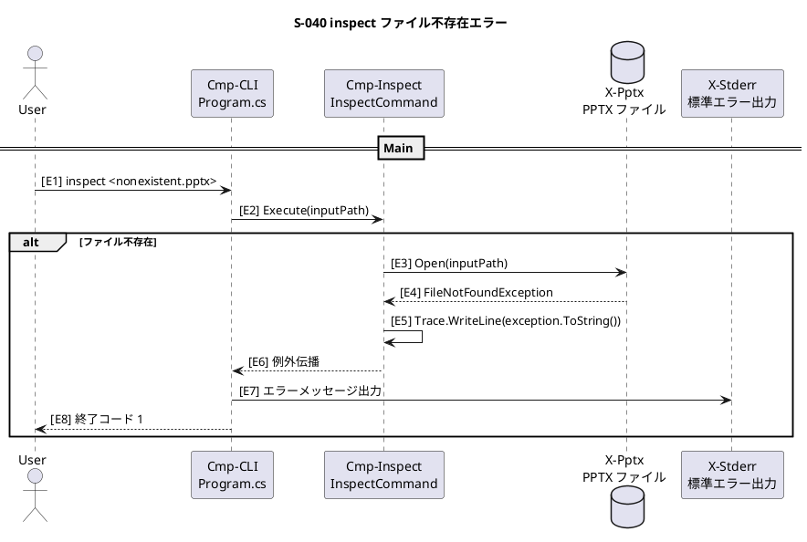
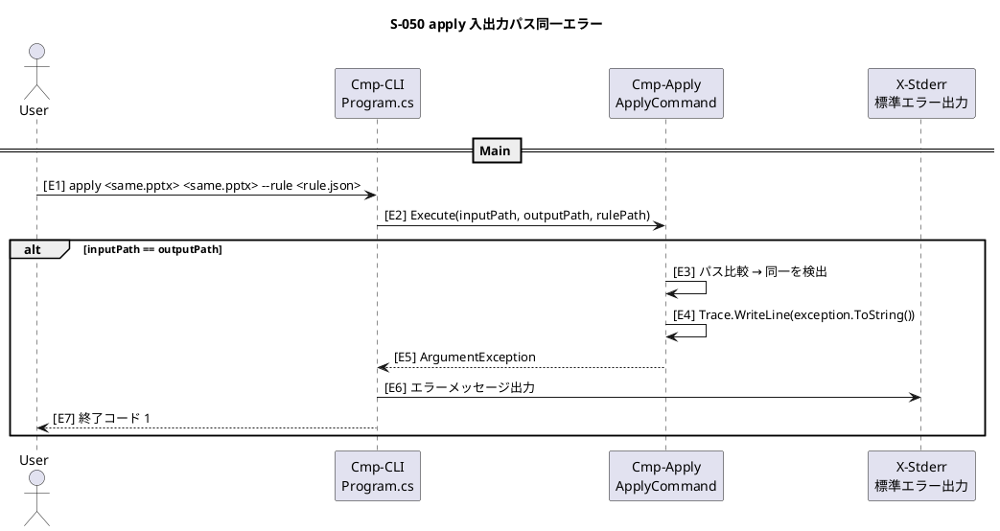

```plantuml
@startuml

title S-010 inspect 正常系

actor "User" as User
participant "Cmp-CLI\nProgram.cs" as Cmp_CLI
participant "Cmp-Inspect\nInspectCommand" as Cmp_Inspect
participant "Cmp-Walker\nSlideWalker" as Cmp_Walker
database "X-Pptx\nPPTX ファイル" as X_Pptx
participant "X-Stdout\n標準出力" as X_Stdout

== Main ==
User -> Cmp_CLI : [E1] inspect <input.pptx>
Cmp_CLI -> Cmp_Inspect : [E2] Execute(inputPath)
Cmp_Inspect -> X_Pptx : [E3] Open(inputPath, ReadOnly)
X_Pptx --> Cmp_Inspect : [E4] PresentationDocument
Cmp_Inspect -> Cmp_Walker : [E5] Walk(presentationDocument)
Cmp_Walker -> Cmp_Walker : [E6] 全スライド・全Shape・全段落を走査
Cmp_Walker --> Cmp_Inspect : [E7] IEnumerable<ParagraphInfo>
Cmp_Inspect -> X_Stdout : [E8] TSV ヘッダー + 各行出力
Cmp_Inspect --> Cmp_CLI : [E9] ExitCode=0
Cmp_CLI --> User : [E10] 終了コード 0

@enduml
```

```plantuml
@startuml

title S-020 apply 正常系

actor "User" as User
participant "Cmp-CLI\nProgram.cs" as Cmp_CLI
participant "Cmp-Apply\nApplyCommand" as Cmp_Apply
participant "Cmp-Rule\nNumberingRule" as Cmp_Rule
database "X-RuleJson\nルール JSON" as X_RuleJson
participant "Cmp-Walker\nSlideWalker" as Cmp_Walker
participant "Cmp-Counter\nHeadingCounter" as Cmp_Counter
participant "Cmp-Replacer\nPrefixReplacer" as Cmp_Replacer
database "X-Pptx\nPPTX ファイル" as X_Pptx

== Main ==
User -> Cmp_CLI : [E1] apply <input.pptx> <output.pptx> --rule <rule.json>
Cmp_CLI -> Cmp_Apply : [E2] Execute(inputPath, outputPath, rulePath)
Cmp_Apply -> Cmp_Apply : [E3] inputPath != outputPath を検証
Cmp_Apply -> X_RuleJson : [E4] Read(rulePath)
X_RuleJson --> Cmp_Apply : [E5] JSON 文字列
Cmp_Apply -> Cmp_Rule : [E6] Deserialize(json)
Cmp_Rule --> Cmp_Apply : [E7] NumberingRule オブジェクト
Cmp_Apply -> Cmp_Counter : [E8] new HeadingCounter(rule.levels)
Cmp_Apply -> X_Pptx : [E9] Open(inputPath, ReadOnly) + MemoryStream コピー
X_Pptx --> Cmp_Apply : [E10] PresentationDocument (in memory)
Cmp_Apply -> Cmp_Walker : [E11] Walk(presentationDocument)
Cmp_Walker --> Cmp_Apply : [E12] IEnumerable<ParagraphInfo>

loop 各段落について
  Cmp_Apply -> Cmp_Apply : [E13] excludedSlideRanges を確認
  alt 除外スライド
    Cmp_Apply -> Cmp_Apply : [E14] スキップ（変更なし / カウンタ不変）
  else 対象スライド
    Cmp_Apply -> Cmp_Apply : [E15] levels 配列を順に評価し、各 level の match / matches を OR 判定
    alt マッチあり
      Cmp_Apply -> Cmp_Counter : [E16] Increment(levelName)
      Cmp_Counter --> Cmp_Apply : [E17] currentCounts
      Cmp_Apply -> Cmp_Counter : [E18] Format(template)
      Cmp_Counter --> Cmp_Apply : [E19] 番号文字列
      Cmp_Apply -> Cmp_Replacer : [E20] Replace(paragraph, newPrefix, separator)
      Cmp_Replacer -> Cmp_Replacer : [E21] Run チェーンから旧プレフィックス削除 + 新番号挿入
      Cmp_Replacer --> Cmp_Apply : [E22] 差し替え完了
    else マッチなし
      Cmp_Apply -> Cmp_Apply : [E23] スキップ（変更なし）
    end
  end
end

Cmp_Apply -> X_Pptx : [E24] Save(outputPath)
Cmp_Apply --> Cmp_CLI : [E25] ExitCode=0
Cmp_CLI --> User : [E26] 終了コード 0

@enduml
```

```plantuml
@startuml

title S-060 apply JSON 不正エラー

actor "User" as User
participant "Cmp-CLI\nProgram.cs" as Cmp_CLI
participant "Cmp-Apply\nApplyCommand" as Cmp_Apply
participant "Cmp-Rule\nNumberingRule" as Cmp_Rule
database "X-RuleJson\nルール JSON" as X_RuleJson
participant "X-Stderr\n標準エラー出力" as X_Stderr

== Main ==
User -> Cmp_CLI : [E1] apply <input.pptx> <output.pptx> --rule <broken.json>
Cmp_CLI -> Cmp_Apply : [E2] Execute(inputPath, outputPath, rulePath)
Cmp_Apply -> Cmp_Apply : [E3] パス検証 OK
Cmp_Apply -> X_RuleJson : [E4] Read(rulePath)
X_RuleJson --> Cmp_Apply : [E5] 不正な JSON 文字列

alt JSON パースエラー
  Cmp_Apply -> Cmp_Rule : [E6] Deserialize(json)
  Cmp_Rule --> Cmp_Apply : [E7] JsonException
  Cmp_Apply -> Cmp_Apply : [E8] Trace.WriteLine(exception.ToString())
  Cmp_Apply --> Cmp_CLI : [E9] 例外伝播
  Cmp_CLI -> X_Stderr : [E10] エラーメッセージ出力
  Cmp_CLI --> User : [E11] 終了コード 1
end

@enduml
```

# Runtime Evidence: PowerPoint カスタム見出し連番ツール

> 元Plan: `plans/pptx-headline-numbering.md`

---

## 粒度宣言（Granularity）

- 対象粒度: Component（C# クラス単位のコンポーネント境界）
- 非対象: メソッド単位の内部実装詳細

---

## C4 語彙テーブル（Vocabulary）

| ID | 種別 | 正式名 | 役割（1行） | 住所（実装の場所） | 主要IF/依存 | Alias |
|---|---|---|---|---|---|---|
| Cmp-CLI | Component | Program.cs | CLI エントリポイント、System.CommandLine によるサブコマンド振り分け | src/PptxHeadlineNumbering/Program.cs | System.CommandLine | - |
| Cmp-Inspect | Component | InspectCommand | inspect モード: 全段落情報を TSV 出力 | src/PptxHeadlineNumbering/InspectCommand.cs | Cmp-Walker, X-Pptx | - |
| Cmp-Apply | Component | ApplyCommand | apply モード: ルールに従い番号付与し別ファイル保存 | src/PptxHeadlineNumbering/ApplyCommand.cs | Cmp-Walker, Cmp-Counter, Cmp-Replacer, Cmp-Rule | - |
| Cmp-Walker | Component | SlideWalker | スライド走査・段落分類、ParagraphInfo 生成 | src/PptxHeadlineNumbering/SlideWalker.cs | Open XML SDK | - |
| Cmp-Counter | Component | HeadingCounter | H1/H2/H3 カウンタ管理・フォーマット | src/PptxHeadlineNumbering/HeadingCounter.cs | - | - |
| Cmp-Replacer | Component | PrefixReplacer | 先頭トークン検出・差し替え（Run 分割対応） | src/PptxHeadlineNumbering/PrefixReplacer.cs | Open XML SDK | - |
| Cmp-Rule | Component | NumberingRule | JSON ルールファイルのデシリアライズモデル | src/PptxHeadlineNumbering/NumberingRule.cs | System.Text.Json | - |
| X-Pptx | External | PPTX ファイル | 入力/出力の .pptx ファイル | (ファイルシステム) | File I/O | - |
| X-RuleJson | External | ルール JSON | 番号付与ルール定義ファイル | (ファイルシステム) | File I/O | - |
| X-Stdout | External | 標準出力 | TSV 出力先 | (コンソール) | Console | - |
| X-Stderr | External | 標準エラー出力 | エラーメッセージ出力先 | (コンソール) | Console | - |

---

## Scenario Sections

### Scenario S-010: inspect 正常系

**Summary:** ユーザーが .pptx ファイルを指定して inspect コマンドを実行し、全段落情報を TSV で標準出力に得る。
**Participants (C4 IDs):** Cmp-CLI, Cmp-Inspect, Cmp-Walker, X-Pptx, X-Stdout

#### Sequence (PlantUML)

#### Component–Step Map

- Cmp-CLI: Steps E1, E2, E9, E10
- Cmp-Inspect: Steps E2, E3, E4, E5, E7, E8, E9
- Cmp-Walker: Steps E5, E6, E7
- X-Pptx: Steps E3, E4
- X-Stdout: Steps E8

---

### Scenario S-020: apply 正常系

**Summary:** ユーザーが JSON ルールファイルとともに apply コマンドを実行し、番号付与済みの .pptx を別ファイルとして保存する。
**Participants (C4 IDs):** Cmp-CLI, Cmp-Apply, Cmp-Rule, Cmp-Walker, Cmp-Counter, Cmp-Replacer, X-Pptx, X-RuleJson

#### Sequence (PlantUML)

#### Component–Step Map

- Cmp-CLI: Steps E1, E2, E25, E26
- Cmp-Apply: Steps E2, E3, E4, E5, E6, E7, E8, E9, E10, E11, E12, E13, E14, E15, E16, E17, E18, E19, E20, E22, E23, E24, E25
- Cmp-Rule: Steps E6, E7
- X-RuleJson: Steps E4, E5
- Cmp-Walker: Steps E11, E12
- Cmp-Counter: Steps E8, E14, E15, E16, E17
- Cmp-Replacer: Steps E18, E19, E20
- X-Pptx: Steps E9, E10, E22

---

### Scenario S-030: apply 冪等性（2回目実行）

**Summary:** 前回 apply 済みの .pptx を再度入力として apply を実行し、既存番号が正しく上書きされて同一結果を得る（冪等性の保証）。
**Participants (C4 IDs):** Cmp-CLI, Cmp-Apply, Cmp-Rule, Cmp-Walker, Cmp-Counter, Cmp-Replacer, X-Pptx, X-RuleJson

#### Sequence (PlantUML)

#### Component–Step Map

- Cmp-CLI: Steps E1, E2, E22, E23
- Cmp-Apply: Steps E2, E3, E4, E5, E6, E7, E8, E9, E10, E11, E12, E13, E14, E15, E16, E17, E19, E20, E21, E22
- Cmp-Rule: Steps E6, E7
- X-RuleJson: Steps E4, E5
- Cmp-Walker: Steps E11, E12
- Cmp-Counter: Steps E8, E14, E15, E16
- Cmp-Replacer: Steps E17, E18, E19
- X-Pptx: Steps E9, E10, E21

---

### Scenario S-040: inspect ファイル不存在エラー

**Summary:** 存在しない .pptx パスを inspect に渡した場合、FileNotFoundException が発生しエラー終了する。
**Participants (C4 IDs):** Cmp-CLI, Cmp-Inspect, X-Pptx, X-Stderr

#### Sequence (PlantUML)

#### Component–Step Map

- Cmp-CLI: Steps E1, E2, E6, E7, E8
- Cmp-Inspect: Steps E2, E3, E4, E5, E6
- X-Pptx: Steps E3, E4
- X-Stderr: Steps E7

---

### Scenario S-050: apply 入出力パス同一エラー

**Summary:** apply コマンドで入力パスと出力パスに同一パスを指定した場合、ArgumentException でエラー終了する。
**Participants (C4 IDs):** Cmp-CLI, Cmp-Apply, X-Stderr

#### Sequence (PlantUML)

#### Component–Step Map

- Cmp-CLI: Steps E1, E2, E5, E6, E7
- Cmp-Apply: Steps E2, E3, E4, E5
- X-Stderr: Steps E6

---

### Scenario S-060: apply JSON 不正エラー

**Summary:** 不正な JSON を --rule に指定した場合、JsonException が発生しエラー終了する。
**Participants (C4 IDs):** Cmp-CLI, Cmp-Apply, Cmp-Rule, X-RuleJson, X-Stderr

#### Sequence (PlantUML)

#### Component–Step Map

- Cmp-CLI: Steps E1, E2, E9, E10, E11
- Cmp-Apply: Steps E2, E3, E4, E5, E6, E7, E8, E9
- Cmp-Rule: Steps E6, E7
- X-RuleJson: Steps E4, E5
- X-Stderr: Steps E10

---

## Scenario Ledger

| Scenario ID | 目的/価値（1行） | Given（前提） | When（トリガ） | Then（結果） | 参加者（Vocabulary ID） | 入出力/メッセージ | 例外・タイムアウト・リトライ | 観測点（ログ/メトリクス） | 参照 |
|---|---|---|---|---|---|---|---|---|---|
| S-010 | 全段落構造を TSV で一覧出力し番号付与対象を確認できる | 有効な .pptx ファイルが存在する | `inspect <input.pptx>` を実行する | TSV が stdout に出力され ExitCode=0 で終了する | Cmp-CLI, Cmp-Inspect, Cmp-Walker, X-Pptx, X-Stdout | File: input.pptx → stdout: TSV | なし（正常系） | Trace: 正常時はログ出力なし | Plan §シナリオ1 |
| S-020 | ルールに従い番号を付与して別ファイルに保存する | 有効な .pptx と rule.json が存在する | `apply <input.pptx> <output.pptx> --rule <rule.json>` を実行する | output.pptx が番号付与済みで保存され ExitCode=0 で終了する | Cmp-CLI, Cmp-Apply, Cmp-Rule, Cmp-Walker, Cmp-Counter, Cmp-Replacer, X-Pptx, X-RuleJson | File: input.pptx + rule.json → File: output.pptx | JSON パースエラー → S-060、File I/O エラー → 例外伝播。`match.shapeNames` と `matches` により PlaceholderType 無しや複数レイアウトの OR 条件も表現可能。`excludedSlideRanges` により複数の 1-based スライド範囲を対象外にでき、その範囲では採番も進まない | Trace: 例外時のみ exception.ToString() | Plan §シナリオ2 |
| S-030 | 2回目の apply で既存番号を正しく上書きし冪等性を保つ | 1回目 apply 済みの .pptx と同一 rule.json が存在する | 同一ルールで `apply` を再実行する | 出力内容が1回目の apply 結果と同一になる | Cmp-CLI, Cmp-Apply, Cmp-Rule, Cmp-Walker, Cmp-Counter, Cmp-Replacer, X-Pptx, X-RuleJson | File: prev_output.pptx + rule.json → File: output2.pptx | prefixRegex が既存番号をマッチしない場合は二重付与 → テストで検証 | Trace: 例外時のみ exception.ToString() | Plan §シナリオ3 |
| S-040 | 存在しないファイル指定時に明確なエラーを返す | 指定パスにファイルが存在しない | `inspect <nonexistent.pptx>` を実行する | FileNotFoundException が発生し ExitCode=1 で終了する | Cmp-CLI, Cmp-Inspect, X-Pptx, X-Stderr | stderr: エラーメッセージ | FileNotFoundException → Trace 出力 → ExitCode=1 | Trace: exception.ToString() | Plan §シナリオ4 |
| S-050 | 入出力パス同一を事前検出しデータ破壊を防ぐ | 入力パスと出力パスが同一である | `apply <same.pptx> <same.pptx> --rule <r.json>` を実行する | ArgumentException が発生し ExitCode=1 で終了する | Cmp-CLI, Cmp-Apply, X-Stderr | stderr: エラーメッセージ | ArgumentException → Trace 出力 → ExitCode=1 | Trace: exception.ToString() | Plan §シナリオ5 |
| S-060 | 不正な JSON を検出し明確なエラーを返す | rule.json が壊れた JSON である | `apply <in.pptx> <out.pptx> --rule <broken.json>` を実行する | JsonException が発生し ExitCode=1 で終了する | Cmp-CLI, Cmp-Apply, Cmp-Rule, X-RuleJson, X-Stderr | stderr: エラーメッセージ | JsonException → Trace 出力 → ExitCode=1 | Trace: exception.ToString() | Plan §シナリオ6 |

---

## コード対応（Mapping）

| Vocabulary ID | 実装の住所（具体） | 主なエントリポイント | テスト観点（最小） |
|---|---|---|---|
| Cmp-CLI | src/PptxHeadlineNumbering/Program.cs | Main / RootCommand | ExitCode 0/1 の分岐 |
| Cmp-Inspect | src/PptxHeadlineNumbering/InspectCommand.cs | Execute() | TSV 出力形式の正確性 |
| Cmp-Apply | src/PptxHeadlineNumbering/ApplyCommand.cs | Execute() | 入出力パス検証、番号付与の E2E |
| Cmp-Walker | src/PptxHeadlineNumbering/SlideWalker.cs | Walk() | PlaceholderType 判定、Level 検出 |
| Cmp-Counter | src/PptxHeadlineNumbering/HeadingCounter.cs | Increment() / Format() | カウンタのインクリメント・リセット・フォーマット |
| Cmp-Replacer | src/PptxHeadlineNumbering/PrefixReplacer.cs | Replace() | 単一/複数 Run、プレフィックス有無、全角スペース |
| Cmp-Rule | src/PptxHeadlineNumbering/NumberingRule.cs | Deserialize() | 正常 JSON / 不正 JSON |
| X-Pptx | (ファイルシステム) | - | テスト用 .pptx は Open XML SDK でコード生成 |
| X-RuleJson | (ファイルシステム) | - | テスト用 JSON はテストコード内で定義 |

---

## 網羅性チェック（Checklist）

**A. 語彙（箱）**
- [x] (A1) Plan 内に登場する箱はすべて Vocabulary にある — 全11エントリを定義済み
- [x] (A2) Vocabulary の各箱に "役割1行" と "住所" がある — 全行に記載

**B. シナリオ**
- [x] (B1) 仕様章/要件IDごとに対応する Scenario ID がある — Plan の全6シナリオに対応 (S-010〜S-060)
- [x] (B2) 外部IFが絡む箇所に例外方針がある — S-040(ファイル不存在), S-050(パス同一), S-060(JSON不正)
- [x] (B3) 運用・管理シナリオ — コンソールツールのため起動/停止は CLI レベルで完結（対象外）

**C. 実装の妥当性**
- [x] (C1) シナリオ参加者の "住所" が全て埋まっている — Vocabulary + Mapping で網羅
- [x] (C2) Scenario → Vocabulary → 住所で追える — 全シナリオの参加者が Vocabulary ID を使用
